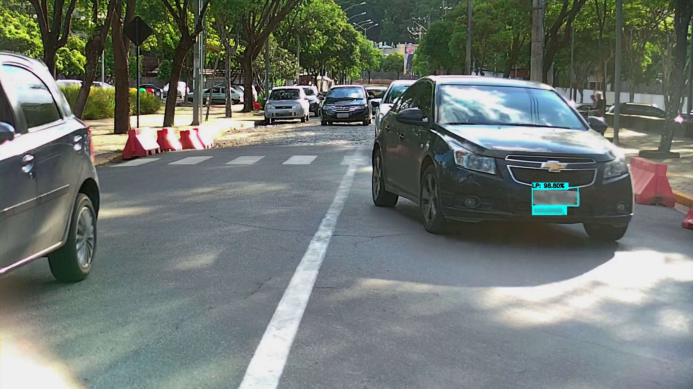
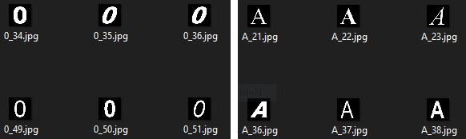

# Deep Learning Applied To Vehicle Registration Plate Detection and Recognition

[](https://www.python.org/downloads/release/python-360/)

# What's this repo about?

This is a simple approach for vehicle registration plate detection and recognition. [*YOLO*](https://github.com/pjreddie/darknet) object detection algorithm was used for license plate region detections, then an image processing pipeline was performed to extract character digits. After that, a Convolutional Neural Network (CNN) - *EMNISTNet* - and the "vanilla" [*Tesseract-OCR*](https://github.com/tesseract-ocr/tesseract) Optical Character Recognition (OCR) were used to recognize the extracted digits.

*Output: vehicle license plate and recognized digits were blurred for an obvious reason.*

# Install and Requirements

*Python version: 3.6*

* Required packages:

````
pip install -r requirements.txt
````

## Tesseract-OCR (optional)

If you also want to use *Tesseract-OCR* for the character recognition task, follow the instructions below:

* Tesseract-OCR binaries:
````
sudo apt update sudo apt install tesseract-ocr
````

* Tesseract-OCR Python API:
````
pip install pytesseract==0.3.3
````

## Pre-trained Weights

Download the pre-trained weights for the YOLO and EMNISTNet and put it in the `config` directory.

* *YOLO* was trained on the Brazilian [SSIG-ALPR](http://smartsenselab.dcc.ufmg.br/en/dataset/banco-de-dados-sense-alpr/) dataset.
  * `TODO:` upload weights and other config files somewhere.

* *EMNISTNet* was trained on the [EMNIST](https://www.nist.gov/itl/products-and-services/emnist-dataset) `bymerge` dataset until it reaches around 89% of accuracy, then training was continued with a custom dataset for fine-tuning. (`TODO:` link the custom dataset).
  * `TODO:` upload weights

# Running

Run the application API:
````
python app.py
````

The app will be listening to requests on http://localhost:5000/

Send an Http POST request with a form-data body with an attribute `file` containing the image, like this:

````
curl --location --request POST 'localhost:5000/' \
--form 'file=@/path/to/the/image/file/image_file.png'
````

### API Output:

Although multiple detections and recognitions are possible in the same image, the API will output the prediction for the detection with the highest confidence. 

`json object` response:

````
{
  "bounding_box": {
    "h": 51,
    "w": 127,
    "x": 1474,
    "y": 520
  },
  "classId": "0",
  "confidence": 1.0,
  "emnist_net_preds": "ABC1234",
  "tesseract_preds": "ABC1234"
}
````

*Note: If `DEBUG` flag is set to `True` in the `app.py`, images will be produced in the `debug` directory for every step in the process.*

# How To Train

If you want to train the models by yourself, or just want to use your custom datasets, just follow the instructions below:

## YOLO

* You can find [here](https://github.com/AlexeyAB/darknet) very clear instructions on how to train YOLO on your dataset.

## EMNISTNet

Go the EMNISTNet directory and simply type:
````
python train_model.py --e=5 --cuda --v
````

* Params: 
  * --e=number_of_epochs: the number of epochs you want to train your model
  * --cuda: if you want to train on GPU that supports CUDA
  * --v: verbose mode

### Fine-tuning on a custom dataset

As we know the EMNIST is a handwritten character digits dataset and the extracted digits of license plates are not handwritten, so EMNISTNet may not give the desired accuracy on these particular images. To circumvent this issue, training was carried out on a custom dataset where digits are more like to our problem domain. `Data Augmentation` methods, such as `rotation` and `shear`, was also applied.

*Custom dataset: examples of character digits*

````
python train_model.py --m=emnist_model.pt --d=custom_dataset/ --e=10 --cuda --v
````

* Params: 
  * --m=previous_model.pt: start weights from a pre-trained model and continue training from there
  * --d=path_to_the_custom_dataset: path to our custom dataset

*Note: Since pytorch DataLoader keeps its own internal class indexes for the target labels based on the alphabetical order, and image subdirectories are used as class labels, in order to keep track of the `idx` like this:*

`idx = ['0','1','2','3','4','5','6','7','8','9','A','B','C','D','E','F','G','H','I','J','K','L','M','N','O','P','Q','R','S','T','U','V','W','X','Y','Z']`

*I managed to put images in the custom dataset as shown below:*

````
root_image_dir/a/0_image1.png
root_image_dir/a/0_image2.png
root_image_dir/a/0_imageN.png
root_image_dir/ab/1_imageN.png
root_image_dir/abc/2_imageN.png
root_image_dir/.../..._imageN.png
root_image_dir/abcdefghijklmnopqrstuvwxyzabcdefghi/Y_imageN.png
root_image_dir/abcdefghijklmnopqrstuvwxyzabcdefghij/Z_imageN.png
````
